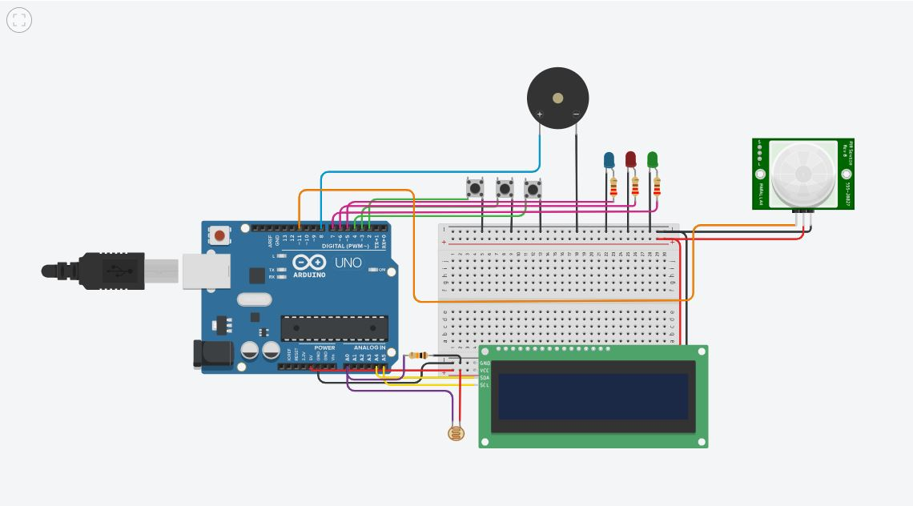

# Projeto Arduino no Tinkercad - LED Pisca

Este é um projeto simples feito no [Tinkercad](https://www.tinkercad.com/), que simula um sistema de segurança residencial utilizando Arduino. O sistema monitora a luminosidade ambiente e sensores de presença, além de botões que simulam o estado de portas, janelas e garagem. Quando detecta situações anormais, como abertura de acessos ou movimento, o sistema aciona alertas visuais (LEDs), sonoros (buzzer) e exibe mensagens em um display LCD para indicar possíveis invasões ou situações de alerta.

## 🔧 Componentes usados
- Arduino 
- Módulo LCD I²C 16x2
- LDR 
- Botões 
- Sensor PIR
- Buzzer Piezoelétrico
- LEDs 

## 🖼️ Simulação

Você pode acessar o projeto online no Tinkercad [clicando aqui]((https://www.tinkercad.com/things/4sYZvdjZxx8-projeto-iot-alarmes-e-sensores)).
